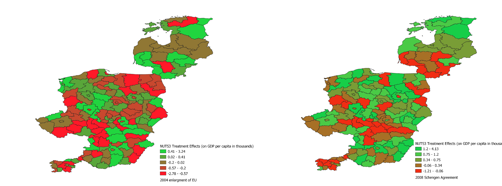

This paper studies the winners and losers of European integration by analyzing its impact on economic performance across sub-regions in Central and Eastern Europe. Using a disaggregated synthetic control method, I estimate the region-specific treatment effects of EU enlargement 2004 and Schengen 2008. The results show a core–periphery dynamic. While interior regions benefited from EU enlargement, border regions experienced losses, leading to an average economic disadvantage of about 2\% relative to interior regions. Following the introduction of Schengen, border regions began to recover as mobility barriers were removed. However, interior regions benefited even more, nearly doubling the gap to 4\% between border and interior areas. In absolute terms, border regions adjacent to incumbent EU member states faced the largest losses after EU enlargement and the smallest gains after Schengen. By contrast, border regions neighboring new EU member states experienced the smallest losses from EU enlargement and the largest gains from Schengen. Overall, these results suggest that European integration, while designed to promote cohesion, may instead increase sub-national disparities.

