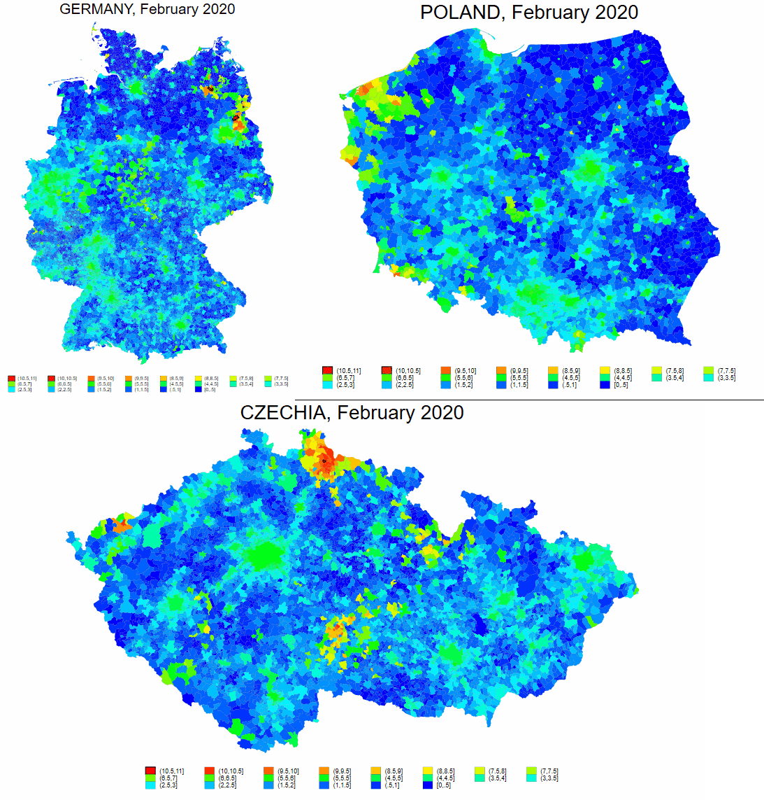

This paper examines the uneven regional impacts of European integration across Central and Eastern Europe (CEE). Using a disaggregated synthetic control approach, I estimate localized treatment effects of market integration following the 2004 EU enlargement and mobility integration following the 2008 Schengen expansion. The results show that integration benefited interior regions more than border regions. Following EU enlargement, border regions lagged behind interior regions by approximately 2.5\%. Schengen improved outcomes in border areas, but the larger gains remained in interior regions. These findings suggest that less developed border regions faced stronger competitive pressures, deepening spatial inequalities within CEE. The findings support more targeted cohesion policy, especially ahead of future EU enlargement.

