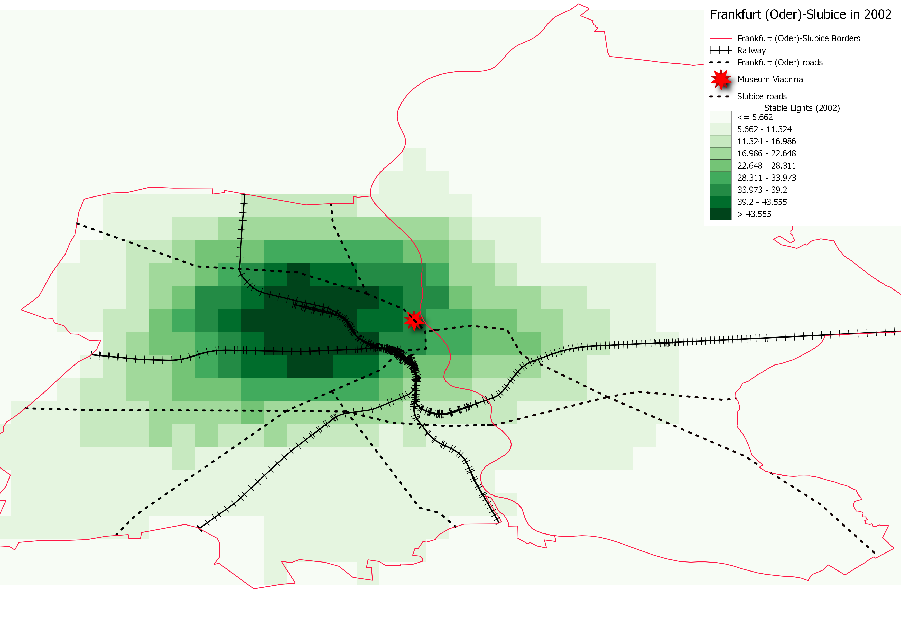
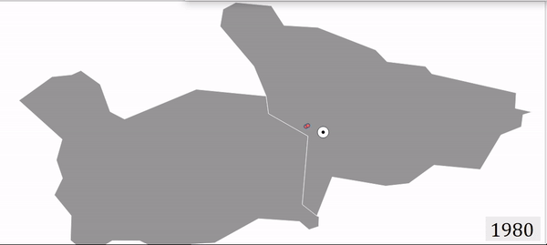

Do spatial concentrations of economic activities have deep historical roots in Europe? This paper explores a unique quasi-natural experiment of opening borders within cities that were historically a single urban entity and were divided due to border shifts following major historical conflicts. After inter-city borders were opened, I find that local economic activities, measured by remotely sensed nightlight, became more concentrated close to the pre-division city centers. This raises an important question, what type of border opening is more important in spurring agglomeration, the free movement of goods or of people? When looking into potential mechanisms behind the impact, using national business register databases, I find that proximity to former historical centers is more prominent, particularly after allowance of the free movement of people as a part of the Schengen agreement in 2008, whereas gaining broader market access following the 2004 EU enlargement is less important. I account for two main channels. First, I show that firms in the consumption sectors are more exposed to the free movement of people and are more likely to start operating closer to historical city centers than are firms in the production sectors, which are less affected by local market potentials. Second, I show that cities in which cultural and language differences are not barriers to cross-border cooperation are more influenced by the free movement of people than cities where these barriers still exist. Hence, spatial agglomerations near pre-division city centers are more apparent in almost borderless cities.

#### Satellite Nighttime Lights 
#### Frankfurt Oder (Germany) - Slubice (Poland)

#### Companies by year of establishment
#### Český Těšín (Czechia) - Cieszyn (Poland)

