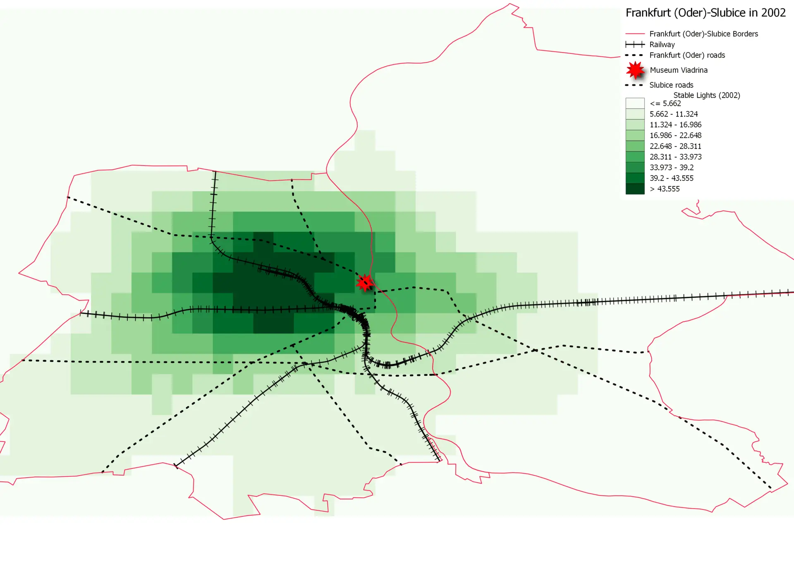

Does the spatial concentration of economic activity in Europe have deep historical roots? This paper exploits a unique quasi-natural experiment—the removal of physical border barriers in cities historically unified, later divided, and subsequently reconnected. Following the Schengen expansion, border removal led to a significant re-concentration of economic activity around pre-division city centers, as measured by the number of firm establishments and nighttime lights. The restoration of cross-border commuter access drove this effect, and agglomeration effects diminished sharply with distance from historical centers. This re-agglomeration occurs through distinct channels that vary based on historical urban structure. In cities that have lost their historical cores, border openings have led consumer-oriented firms to relocate toward pre-war centers, consistent with consumption-based agglomeration driven by consumer pooling. Conversely, in cities that retained their historical centers, re-agglomeration is driven by producer-oriented firms expanding near those cores, resulting in production-based agglomeration through labor pooling. The effects are strongest in linguistically similar city pairs, indicating that linguistic and cultural proximity amplify the re-concentration of economic activity around historical urban cores.

#### Satellite Nighttime Lights 
#### Frankfurt Oder (Germany) - Slubice (Poland)

#### Companies by year of establishment
#### Český Těšín (Czechia) - Cieszyn (Poland)

