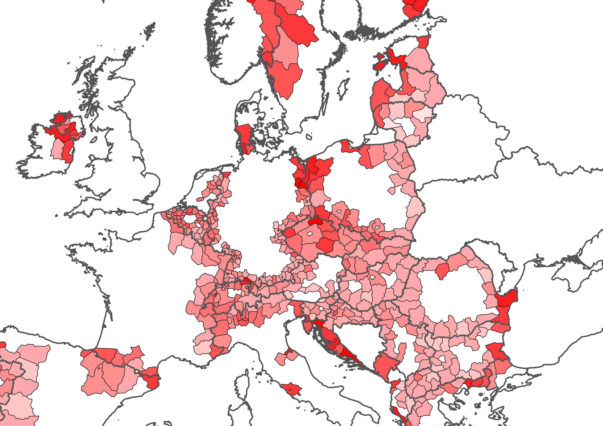

In response to the COVID-19 pandemic, Schengen countries temporarily reintroduced internal border controls, reversing a decades-long trend of European integration. While existing research has focused mainly on national-level effects of border closures, localized economic consequences remain underexplored. This paper leverages the disruption of cross-border mobility as a natural experiment to study the short-run economic impacts of border closures on European municipalities. Using monthly nighttime lights data, we find that border closures reduced economic activity in border municipalities by approximately 2% relative to interior municipalities. The effects are highly heterogeneous. Small municipalities, Eastern border municipalities, and Western municipalities bordering Eastern countries experienced losses, whereas Western border municipalities bordering other Western countries benefited from increased domestic demand. Importantly, we show that the economic impact of cross-border mobility depends on why people cross borders. When mobility supports production - by providing labor, services, or inputs - border closures disrupt supply chains and local economic activities suffer (productive mobility). However, when mobility is mainly for leisure or social visits, restrictions tend to redirect spending toward domestic alternatives, creating localized benefits (discretionary mobility). These findings highlight the importance of place-sensitive policy responses in times of crisis.

#### Nighttime Lights Before and After Border Controls

