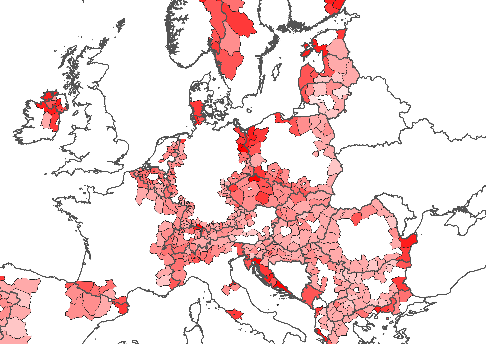

  with <a href="https://sites.google.com/view/iraklibarbakadze/home">Irakli Barbakadze</a>,
  <a href="http://www.fidrmuc.net/">Jan Fidrmuc</a>,
  <a href="https://www.martinhulenyi.eu/">Martin Hulényi</a>

---
We study Russia's February 2022 full-scale invasion of Ukraine as a natural experiment to determine how sudden disruptions to international market access reshape sub-national economic inequalities. Using remotely-sensed nighttime lights as a proxy for economic activity, we estimate the economic effects of the war at the national and regional levels. We find that Russia experienced an overall economic slowdown after the start of the full-scale invasion. Regions in Western and North-Western Russia experienced significantly larger economic contractions, while Southern and Southeastern regions exhibit relative improvements in performance. These findings suggest that sanctions, a shift toward non-Western markets, and increased military production,  have driven significant regional changes in Russia’s economy and urban structure.

