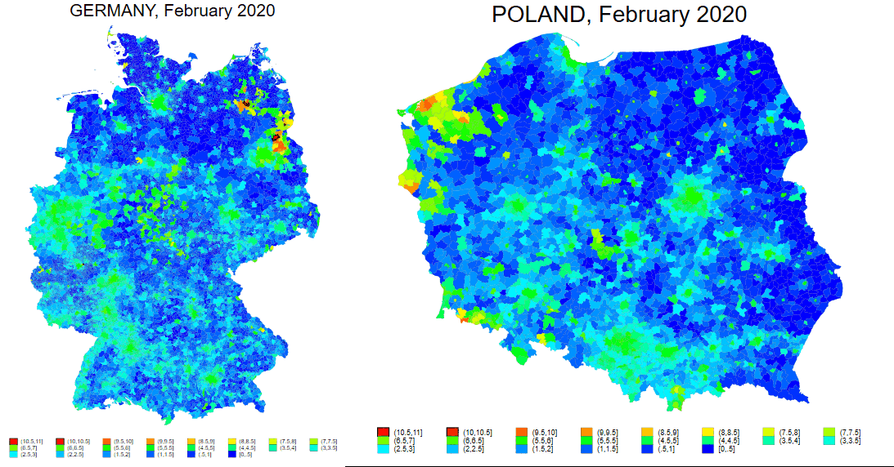

The COVID-19 pandemic brought unprecedented challenges, including the temporary suspension of the principle of free movement of people within the Schengen Area. I evaluate the potential economic cost of controlling European borders during the pandemic. I use unconventional data sources such as NASA’s Black Marble Nighttime Lights (NTL) to provide insights into the economic impact of border restrictions on European municipalities. The results suggest that the impact of travel restrictions vary across cities; economic activities tend to decrease more in cross-border cities than in interior cities, especially in small border cities. The paper also finds a larger decline in NTL radiance in border municipalities of New Member States compared to Old Member States. Using the municipality-type subgroups, the paper shows that border municipalities specialize on manufacturing, consumer and service industries are more adversely affected by border restrictions than similar but agriculture oriented municipalities. Moreover, there is a significant reduction in NTL in municipalities where people oftentimes commute to foreign cross-border areas for shopping, leisure, and business purposes; where large number of residents are employed; and where people have high awareness about EU funded cross-border activities and perceive living near the international border as economic potential rather than barrier.

#### Nighttime Lights Before and After Border Controls

