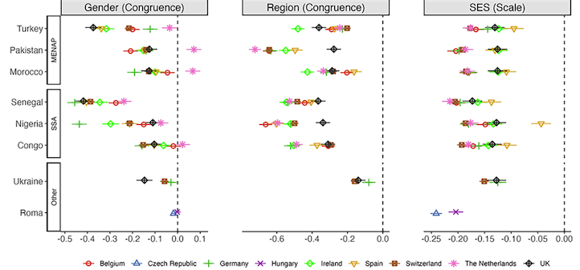

A growing body of research uses field and survey experiments to examine ethnic discrimination. Central to these studies is the use of people’s names as a proxy for ethnic origin. However, names signal more than solely ethnic markers. Moreover, their signals might vary across national contexts. Scholars should pre-test the perception of names used in experiments in order to properly interpret their results and reveal the mechanisms underlying discrimination. There is, however, no comprehensive study yet in Europe which thoroughly pre-test the perception of names across countries with profoundly different migration histories. In this paper, we present the dataset ‘Perceptions of names in Europe’, containing the perceptions of 1078 names studied across nine European countries: Belgium, Czech Republic, Germany, Hungary, Ireland, the Netherlands, Spain, Switzerland, and the United Kingdom. The dataset includes 82.400 evaluations from 8.240 respondents about the distinctiveness of Sub-Sahara African, Muslim and Roma names in terms of minority-majority group status, gender, religiosity, socioeconomic status, skin colour, and language proficiency. Information on respondents’ background characteristics are also available.

