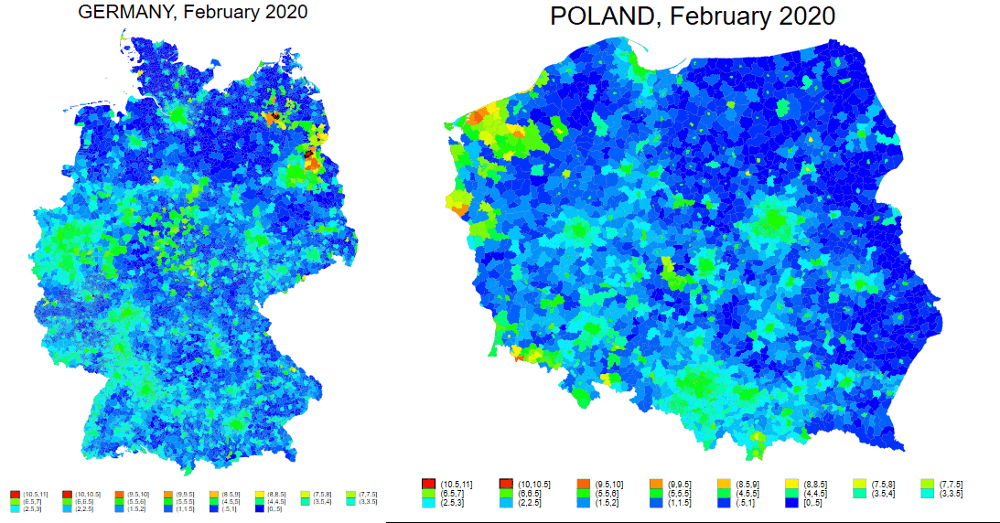

In response to COVID-19, Schengen countries temporarily reintroduced internal border controls, disrupting cross-border integration. Using this policy change as a natural experiment and monthly nighttime lights data, we estimate the short-run effects on European municipalities. Municipalities along internal Schengen borders experienced a 3--4\% decline in economic activity relative to interior municipalities, with larger estimated effects when external-border municipalities form the comparison group. Losses were greater in smaller and less densely populated municipalities and along economically asymmetric East–West borders, whereas municipalities along more economically similar borders generally experienced smaller declines. The effects also depended on the pre-pandemic purpose of cross-border mobility: higher shares of work- and business-related travel, services, and shopping were associated with larger losses, while the results for leisure and social mobility are consistent with greater scope for domestic reallocation of activity. Overall, the findings show that the local consequences of internal border closures depend on  municipality characteristics, cross-border economic asymmetries, and the purpose of mobility.

#### Nighttime Lights Before and After Border Controls

